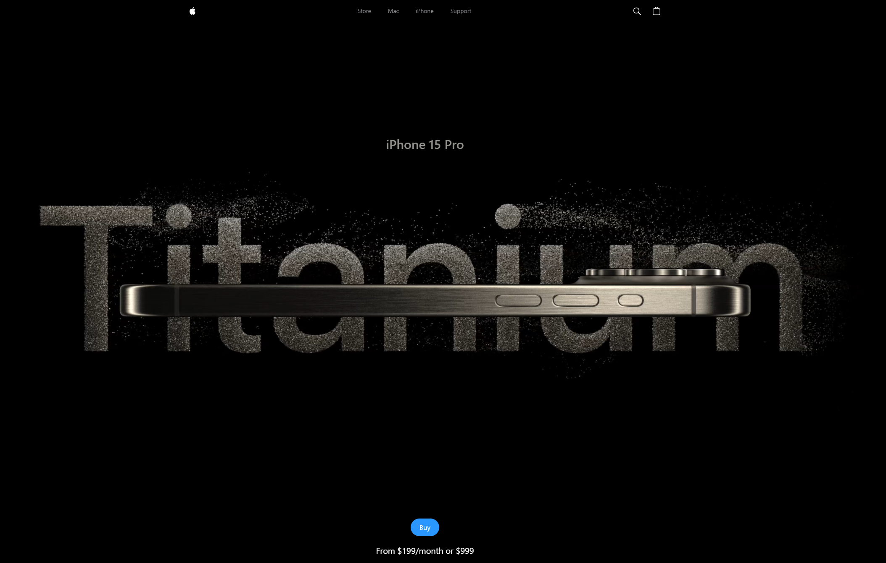
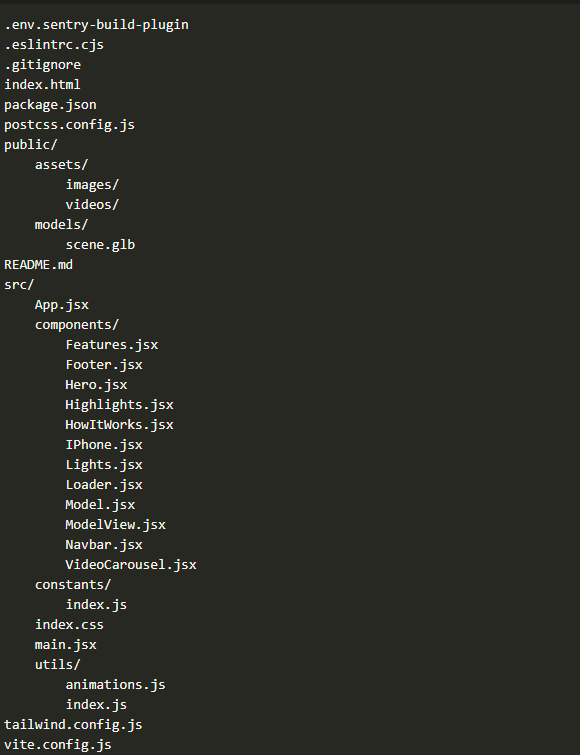

# web-Apple-Clone

This project is a clone of the Apple website built using React and Vite. It includes various components and features to replicate the look and feel of the original website.



## Table of Contents

- [Features](#features)
- [Installation](#installation)
- [Usage](#usage)
- [Scripts](#scripts)
- [Dependencies](#dependencies)
- [Development](#development)
- [License](#license)

## Features

- React with Vite for fast development and hot module replacement (HMR)
- Three.js for 3D models and animations
- Sentry for error tracking and monitoring
- Tailwind CSS for styling
- ESLint for code linting
- PostCSS for CSS processing

## Installation

1. Clone the repository:

    ```sh
    git clone https://github.com/your-username/web-Apple-Clone.git
    cd web-Apple-Clone
    ```

2. Install the dependencies:

    ```sh
    npm install
    ```

## Usage

To start the development server:

```sh
npm run dev
```

## Scripts

- `dev`: Starts the development server using Vite.

    ```sh
    npm run dev
    ```

- `build`: Builds the project for production.

    ```sh
    npm run build
    ```

- `lint`: Runs ESLint to lint the code.

    ```sh
    npm run lint
    ```

- `preview`: Previews the production build.

    ```sh
    npm run preview
    ```

## Dependencies

- `react`: ^18.3.1
- `react-dom`: ^18.3.1
- `react-router-dom`: ^6.26.0
- `@react-three/drei`: ^9.109.2
- `@react-three/fiber`: ^8.16.8
- `three`: ^0.167.1
- `@sentry/react`: ^8.22.0
- `@sentry/tracing`: ^7.114.0
- `@sentry/vite-plugin`: ^2.21.1
- `@gsap/react`: ^2.1.1
- `gsap`: ^3.12.5

## Development

### File Structure

  

## License

This project is licensed under the MIT License. See the [LICENSE](LICENSE) file for more details.
